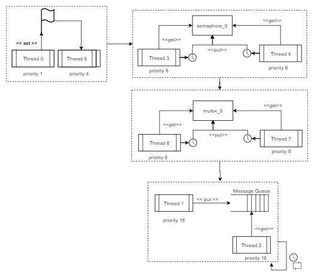

# Lab 5 - ThreadX

## azure_rtos workspace

### Threads in sample_threadx.c
| Thread Name | entry function | stack size | priority | auto start | time slicing |
|-------------|----------------|------------|----------|------------|--------------|
| thread 0    | thread_0_entry |    1024    |    1     |    yes     |      no      |
| thread 1    | thread_1_entry |    1024    |   16     |    yes     |      sim (4) |
| thread 2    | thread_2_entry |    1024    |   16     |    yes     |      sim (4) |
| thread 3    | thread_3_and_4_entry |    1024    |    8     |    yes     |      no      |
| thread 4    | thread_3_and_4_entry |    1024    |    8     |    yes     |      no      |
| thread 5    | thread_5_entry |    1024    |    4     |    yes     |      no      |
| thread 6    | thread_6_and_7_entry |    1024    |    8     |    yes     |      no      |
| thread 7    | thread_6_and_7_entry |    1024    |    8     |    yes     |      no      |

### Objects in sample_threadx.c
| Name         | Control Structure | Size | Location         |
|--------------|-------------------|------|------------------|
| byte pool 0  | byte_pool_0       | 9120 | byte_pool_memory |
| block pool 0 | block_pool_0      | 100  |                  |
| semaphore 0 | semaphore_0        | 32  |                  |
| mutex 0 | mutex_0        | 32  |                  |
| event flags 0 | event_flags_0        | 32  |                  |

## Diagrama

O diagrama abaixo demonstra o funcionamento do programa `sample_trheadx.c`. Primeiramente inicia-se pela Thread 0, pois ela possui a maior prioridade, que seta uma flag que chama a Thread 5 que tem a segunda maior prioridade entre todas as threads criadas. Após a execução da Thread 5, por uma questão de inicialização e estado de `ready` da Thread 3 antes das threads 4,6 e 7 (que possuem a mesma prioridade), a Thread 3 começa a rodar disputando o semafóro `semaphore_0` com a Thread 4. Após isso, a Thread 6 inicia, disputando o mutex `mutex_0` com a Thread 7 e após isso a Thread 1 é iniciada mandando mensagens para uma fila de mensagens compartilhada com a Thread 2 (que apenas lê essas mensagens).

É interessante notar que a Thread 1 e Thread 2 ficam rodando indefinidamente, enquanto as outras rodam apenas 1 vez.

Então basicamente a ordem que as threads são executadas é a seguinte:

**Thread 0 -> Thread 5 -> Thread 3 -> Thread 4 -> Thread 6 -> Thread 7 -> Thread 1 -> Thread 2**

